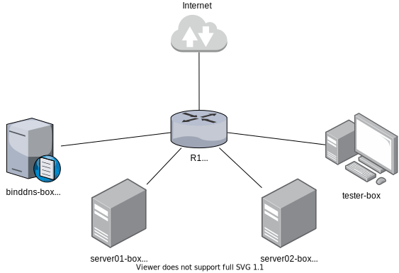

# binddns-box

| License | Versioning | Build |
| ------- | ---------- | ----- |
| [](https://opensource.org/licenses/MIT) | [](https://github.com/semantic-release/semantic-release) | [](https://ci.appveyor.com/project/nikAizuddin/binddns-box/branch/master) |

Developer box for [BIND](https://www.isc.org/bind/) DNS server.




## Getting started

Clone this repository and `cd` into the project:
```
$ git clone --recursive https://github.com/extra2000/binddns-box.git
$ cd binddns-box
```

Create Vagrant files for `binddns-box`, `server01-box`, `server02-box`, and `tester-box` based on the examples:
```
$ cp -v vagrant/examples/binddns/Vagrantfile.binddns-box.fedora-33.x86_64.example vagrant/Vagrantfile.binddns-box
$ cp -v vagrant/examples/server01/Vagrantfile.server01-box.fedora-33.x86_64.example vagrant/Vagrantfile.server01-box
$ cp -v vagrant/examples/server02/Vagrantfile.server02-box.fedora-33.x86_64.example vagrant/Vagrantfile.server02-box
$ cp -v vagrant/examples/tester/Vagrantfile.tester-box.fedora-33.x86_64.example vagrant/Vagrantfile.tester-box
```

Create pillar file for BIND DNS. You can change the value in this pillar file:
```
$ cp -v salt/roots/pillar/binddns.sls.example salt/roots/pillar/binddns.sls
```

Then, up all Vagrant boxes. You can also change to `--provider=virtualbox`:
```
$ vagrant up --provider=libvirt
$ vagrant ssh binddns-box -- sudo salt-call state.highstate
```

Create zone using example files. You may need to change the IP address:
```
$ cp -v salt/roots/formulas/binddns-formula/binddns/files/zones.conf.example salt/roots/formulas/binddns-formula/binddns/files/zones.conf
$ cp -v salt/roots/formulas/binddns-formula/binddns/files/zones/mynet.zone.example salt/roots/formulas/binddns-formula/binddns/files/zones/mynet.zone
```

Finally, execute `vagrant rsync binddns-box` to upload all changes into `binddns-box`:
```
$ vagrant rsync binddns-box
```

Install and configure BIND DNS server on `binddns-box`:
```
$ vagrant ssh binddns-box -- sudo salt-call state.sls binddns
```


## Deploy Filebeat (optional)

On `binddns-box`, add the following lines into `/usr/lib/systemd/system/named.service` to log output into files:
```
...
[Service]
StandardOutput=append:/var/log/named/named.log
StandardError=append:/var/log/named/named.log
```

Create `/var/log/named` directory:
```
$ sudo mkdir -pv /var/log/named
```

Reload `systemd` and `named.service`:
```
$ sudo systemctl daemon-reload
$ sudo systemctl restart named.service
```

Deploy Filebeat:
```
$ sudo salt-call state.sls filebeat
```


## Pointing clients DNS to `binddns-box`

The followings command should be executed on `server01-box`, `server02-box`, and `tester-box`.

For RedHat family:
```
$ sudo nmcli connection modify "Wired connection 1" ipv4.dns "192.168.121.67"
$ sudo nmcli connection modify "Wired connection 1" ipv4.ignore-auto-dns yes
$ sudo systemctl restart NetworkManager.service
```

For Debian, put the following line into `/etc/resolvconf/resolv.conf.d/head` file as shown below. Then, execute `$ sudo systemctl restart resolvconf.service`:
```
# Dynamic resolv.conf(5) file for glibc resolver(3) generated by resolvconf(8)
#     DO NOT EDIT THIS FILE BY HAND -- YOUR CHANGES WILL BE OVERWRITTEN

nameserver 192.168.121.17
```

For Ubuntu, set `network.ethernets.eth0.nameservers.addresses` in `/etc/netplan/01-netcfg.yaml` file as shown below. Then, execute `$ sudo netplan apply`:
```
network:
  version: 2
  renderer: networkd
  ethernets:
    eth0:
      dhcp4: true
      dhcp6: false
      optional: true
      nameservers:
        addresses: [192.168.121.67]
```

For SUSE family, set `NETCONFIG_DNS_STATIC_SERVERS="192.168.121.67"` in `/etc/sysconfig/network/config` file. Then, execute:
```
$ sudo netconfig update -f
```
